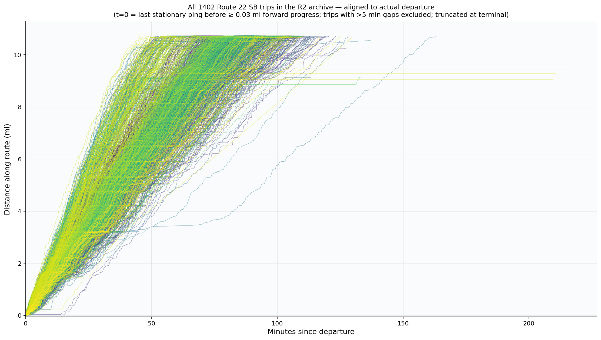

# Reconstructing CTA Route 22 Bus Trajectories

A reproduction of Huang et al., *Reconstructing Transit Vehicle Trajectory
Using High-Resolution GPS Data* (ITSC 2023), applied to CTA Route 22 (Clark)
southbound. Smooths days of CTA BusTime heartbeats with **LOCREG-PCHIP**
to recover continuous, monotone, differentiable trajectories `f(t)`, then
extends the paper with an OSM-derived intersection layer and a delay-attribution
heuristic that ranks the dominant slowdown sources along the corridor.



---

## What's reproduced vs. what's new

| Component                           | Source                | Status                              |
| ----------------------------------- | --------------------- | ----------------------------------- |
| Time / distance into trip from raw GPS | Huang et al. §II      | reproduced                          |
| LOCREG with tricube kernel          | Huang et al. §III-C   | reproduced (different bandwidth)    |
| PCHIP (Fritsch–Carlson)             | Huang et al. §III-B   | reproduced via `scipy.interpolate`  |
| LOCREG-PCHIP hybrid (Algorithm 1)   | Huang et al. §III-D   | reproduced                          |
| LOCREG-MQSI (C² variant)            | —                     | **new**: continuous-acceleration alternative |
| Map-matching                        | Huang et al. §II-B    | **replaced**: shape-snap onto GTFS polyline instead of Valhalla per ping |
| Single-trip qualitative analysis    | Huang et al. §V       | reproduced (CTA Route 22 instead of MBTA Route 1) |
| Speed-at-door-open validation       | Huang et al. §IV-A    | **skipped**: CTA BusTime does not expose door state |
| OSM intersection enrichment         | —                     | **new**                             |
| Delay-attribution heuristic         | —                     | **new**                             |
| Aggregation across hundreds of trips| —                     | **new**                             |

The biggest deviation: where the paper uses `bandwidth = 20` on a 6 s median
heartbeat cadence, we use `bandwidth = 5` because CTA BusTime publishes
positions every ~30 s. Both choices keep the LOCREG window at roughly two
minutes of trip time.

## Repository layout

```
src/bus_trajectories/        core package (installed; the only code with tests)
  ├─ smooth.py               LOCREG, monotonicity fix-up, PCHIP + MQSI smoothers
  ├─ pipeline.py             end-to-end reconstruction from a CSV of pings
  ├─ mapmatch/shape_snap.py  one-step projection onto the GTFS shape
  ├─ mapmatch/valhalla.py    optional Valhalla-based matcher (paper's path)
  ├─ way_match.py            cache OSM ways the shape traverses (Valhalla)
  ├─ intersections.py        Overpass enrichment → ControlPoint records
  ├─ delay_decomposition/    signal-to-signal segmentation + per-segment buckets
  ├─ io.py                   GTFS / AVL-CSV loaders
  ├─ realtime.py             shared client for the public realtime ping archive (R2-hosted)
  ├─ colors.py               shared figure/dashboard palettes
  ├─ vtrak.py                shared dense-VTRAK (ROCKET) loaders + shape picker
  ├─ viz.py / viz_compare.py interactive Plotly comparison viewers
  ├─ plot.py                 static matplotlib helpers
  └─ cli.py                  `bus-trajectories reconstruct | compare | build-*`

scripts/                     build & figure-rendering pipeline (see scripts/README.md)
  ├─ data_prep/              scour the realtime archive → reconstruction bundles
  ├─ smoothing_figs/         LOCREG-PCHIP smoothing & time-space figures
  ├─ vtrak/                  dense-VTRAK validation figures
  ├─ decomposition/          delay-decomposition figures
  └─ dashboard/              interactive MapLibre + D3 dashboards

observation_tool/            field-data collection web app + analysis (see its README)
tests/                       pytest suite
figures/                     curated report figures, families A1..H7 (see below)
intersections_route22.json   precomputed enrichment for shape 67803936 + 6 variants

data/  outputs/  caches/     gitignored — regenerable inputs, bundles, and caches
docs/                        reference papers (gitignored, not redistributable)
```

The `scripts/` tree is versioned and grouped by purpose; each script is a
convenience wrapper around the `bus_trajectories` package. Their inputs and
outputs live in the gitignored `data/`, `outputs/`, and `caches/` folders. See
[`scripts/README.md`](scripts/README.md) for what each group does and the
end-to-end run order.

### Figures

`figures/` holds the curated figure set, named by family (a letter) and
iteration (a number), each produced by the script noted:

| Family | Content | Script |
| ------ | ------- | ------ |
| `A1..A10` | archive → map-match pipeline walkthrough | `smoothing_figs/build_slides.py` |
| `B1..B6`  | speed reconstruction | `smoothing_figs/build_slides.py` |
| `C1..C5`  | time-space (50/100/all trips, multitrip) | `smoothing_figs/build_{50trip,100trip,F4_from_bundle}.py` |
| `D1..D2`  | smoothing explainers (LOCREG, pipeline) | `smoothing_figs/build_locreg_explainer.py`, `build_slides.py` |
| `E1`      | intersection map | `smoothing_figs/build_slides.py` |
| `F1..F5`  | delay decomposition | `decomposition/build_decomposition_figs.py`, `build_speed_profile_fig.py` |
| `G1..G3`  | per-trip attribution (waterfall/bar/stem) | `decomposition/build_attribution_slides.py` |
| `H1..H7`  | corridor-aggregate attribution | `decomposition/build_attribution_slides.py` |

## Quickstart

```bash
uv sync                               # install runtime + dev deps
uv run pytest                         # run the test suite

# reconstruct from a CSV of pings (route 22, pattern 3936) at bandwidth 5
PYTHONPATH=src uv run python -m bus_trajectories reconstruct \
    your_pings.csv --gtfs data/gtfs/cta_gtfs.zip \
    --route 22 --pattern 3936 --bandwidth 5 --serialize --out outputs/out_bw5

# build the interactive bandwidth-comparison HTML over multiple bandwidths
PYTHONPATH=src uv run python -m bus_trajectories compare \
    outputs/out_bw5 outputs/out_bw10 outputs/out_bw20 \
    --gtfs data/gtfs/cta_gtfs.zip --pattern 3936 --out compare.html
```

`cta_gtfs.zip` is downloaded on demand from the CTA's published GTFS feed the
first time a script needs it (into `data/gtfs/`); archived heartbeat data is
fetched lazily from a public Cloudflare R2 bucket (into `caches/realtime_archive/`)
using the paths in its `_manifest.parquet`.

## Data source — note on the scraper

The realtime ping archive is produced by a separate companion repository,
`scrape-bus-pings`, which polls several agencies (MBTA, MTA NYC Bus, TfL, CTA,
TransLink Vancouver) every 15 s, canonicalises every feed to a shared 26-column
schema, batches into 1-minute Parquet files, uploads to Cloudflare R2, and
compacts each completed UTC hour into a single Hive-partitioned object indexed
by a manifest. **That scraper is intentionally not included in this
repository** — it depends on agency API keys and an R2 bucket the analyst would
need to provide. This repo reads from its public R2 bucket
(`pub-777d0904efb449dc838791645b9e2e0f.r2.dev`), treating the archive as a
read-only data source.

## Algorithm in one paragraph

Given a sorted sequence of (timestamp, latitude, longitude) pings on a
single trip:

1. **Map-match**: project each `(lat, lon)` onto the GTFS shape polyline
   (`mapmatch.shape_snap.SnapToShapeMatcher`) to get a distance-into-trip
   value `d_i ∈ [0, L_route]` together with a perpendicular noise estimate.
2. **LOCREG**: at every ping `i`, fit a degree-3 polynomial in `x = t − t_i`
   to the `bandwidth = 5` nearest neighbours, weighted by the tricube
   kernel `w_k = (1 − |x_k/h|³)³`. Take `p(0) = a₀` as the smoothed value.
3. **Monotonise**: `x_i := max(x_i, x_{i-1})` (forward-fill).
4. **PCHIP**: build a piecewise-cubic Hermite spline through the cleaned
   `(t_i, x_i)` knots. The result is C¹, monotone, and made of cubics.
   (`smooth.locreg_mqsi` offers a C² quintic alternative with continuous
   acceleration.)
5. **Speed / acceleration**: `v(t) = f'(t)`, `a(t) = f''(t)` come for free.

## Delay attribution

The **chapter-3 decomposition** (`src/bus_trajectories/delay_decomposition/`
package + `scripts/decomposition/`) follows Huang (2023), *Chapter 3 — Transit
Delay Analysis* (`docs/chapter 3 delay analysis.pdf`): signal-to-signal
segmentation, per-segment
`T_obs = T_ff + T_dwell + D_signal + D_crossing + D_congestion` with `T_ff`
estimated as the 5th-percentile travel time of late-night (22:00–05:00 Chicago)
trips on the same pattern. Produces the `F*` / `G*` / `H*` figure families.

Two deviations from the paper:
- AVL door-open/close data is not available, so dwell is attributed by
  proximity (`[x_stop - 30 m, x_stop + 10 m]`, clipped at intersection
  nodes). The `DwellAttributor` protocol leaves room to drop in an AVL-based
  attributor later without touching the rest of the package.
- Mid-block pedestrian signals count as signalized intersections for
  segmentation. A bus stop within 90 ft (~27.4 m) upstream of any signalized
  intersection is flagged as "near-side"; dwell attributed there is marked
  ambiguous because dwell-time vs. signal-delay can't be separated from GPS
  alone.

Run the decomposition end-to-end:

```bash
# 1. Build the late-night free-flow baseline (scours R2, reconstructs at bw=5,
#    writes p5 per segment).
PYTHONPATH=src uv run python scripts/data_prep/build_freeflow_baseline.py

# 2. Decompose every trip (or one with --trip-id <id>).
PYTHONPATH=src uv run python scripts/decomposition/run_decomposition.py

# 3. Render figures.
PYTHONPATH=src uv run python scripts/decomposition/build_decomposition_figs.py
```

## Sub-projects

- **`observation_tool/`** — a mobile web app for collecting ground-truth field
  data (1 Hz GPS, accelerometer/gyro, hand-tagged delay events) to validate the
  reconstruction pipeline, plus a Python analysis side that compares phone
  tracks against the realtime archive. See [`observation_tool/README.md`](observation_tool/README.md).

## License

Code: MIT. The original Huang et al. paper PDF is not redistributed here.
Map data © OpenStreetMap contributors, available under the Open Database
License. Basemap tiles in figures are CartoDB Positron (No Labels) under
their respective terms.
