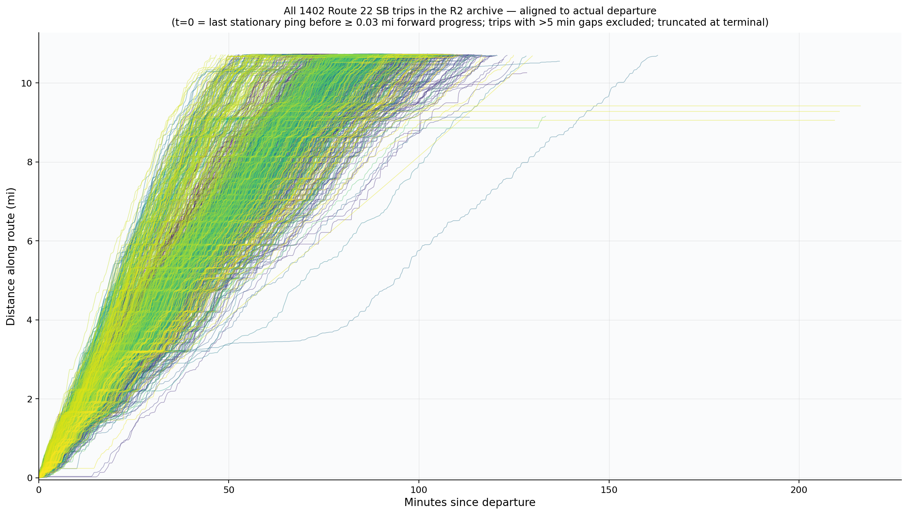

# Reconstructing CTA Route 22 Bus Trajectories

A reproduction of Huang et al., *Reconstructing Transit Vehicle Trajectory
Using High-Resolution GPS Data* (ITSC 2023), applied to CTA Route 22 (Clark)
southbound. Smooths nine days of CTA BusTime heartbeats with **LOCREG-PCHIP**
to recover continuous, monotone, differentiable trajectories `f(t)`, then
extends the paper with an OSM-derived intersection layer and a delay-attribution
heuristic that ranks the dominant slowdown sources along the corridor.

The full write-up is in
[`report/Reconstructing_Bus_Trajectories_Report.pdf`](report/).



---

## What's reproduced vs. what's new

| Component                           | Source                | Status                              |
| ----------------------------------- | --------------------- | ----------------------------------- |
| Time / distance into trip from raw GPS | Huang et al. §II      | reproduced                          |
| LOCREG with tricube kernel          | Huang et al. §III-C   | reproduced (different bandwidth)    |
| PCHIP (Fritsch–Carlson)             | Huang et al. §III-B   | reproduced via `scipy.interpolate`  |
| LOCREG-PCHIP hybrid (Algorithm 1)   | Huang et al. §III-D   | reproduced                          |
| Map-matching                        | Huang et al. §II-B    | **replaced**: shape-snap onto GTFS polyline instead of Valhalla per ping |
| Single-trip qualitative analysis    | Huang et al. §V       | reproduced (CTA Route 22 instead of MBTA Route 1) |
| Speed-at-door-open validation       | Huang et al. §IV-A    | **skipped**: CTA BusTime does not expose door state |
| OSM intersection enrichment         | —                     | **new**                             |
| Delay-attribution heuristic         | —                     | **new**                             |
| Aggregation across hundreds of trips| —                     | **new**                             |

The biggest deviation: where the paper uses `bandwidth = 20` on a 6 s median
heartbeat cadence, we use `bandwidth = 5` because CTA BusTime publishes
positions every ~30 s. Both choices keep the LOCREG window at roughly two
minutes of trip time; we discuss the consequences (boundary-zero degeneracy
of the tricube kernel) in §2.2 and Appendix A of the report.

## Repository layout

```
src/bus_trajectories/        core package
  ├─ smooth.py               LOCREG, monotonicity fix-up, PCHIP
  ├─ pipeline.py             end-to-end reconstruction from a CSV of pings
  ├─ mapmatch/shape_snap.py  one-step projection onto the GTFS shape
  ├─ mapmatch/valhalla.py    optional Valhalla-based matcher (paper's path)
  ├─ way_match.py            cache OSM ways the shape traverses (Valhalla)
  ├─ intersections.py        Overpass enrichment → ControlPoint records
  ├─ io.py                   GTFS / AVL-CSV loaders
  ├─ viz.py / viz_compare.py interactive Plotly comparison viewers
  ├─ plot.py                 static matplotlib helpers
  └─ cli.py                  `bus-trajectories reconstruct | compare | build-*`

tests/                       pytest suite covering smooth, snap, way cache, intersections

figures/                     rendered PNGs used in the report and deck
report/                      project report (DOCX)
intersections_route22.json   precomputed enrichment for shape 67803936 + 6 variants
```

The end-to-end build / figure-rendering scripts (`run_r2_route22_sb.py`,
`build_*.py`, `plot_intersections.py`) are kept locally and are **not tracked
in git** (see `.gitignore`); they are convenience wrappers around the public
`bus-trajectories` CLI exposed by the `src/` package.

## Quickstart

```bash
uv sync                              # install runtime + dev deps
uv run pytest                         # run the test suite

# reconstruct from a CSV of pings (route 22, pattern 3936) at bandwidth 5
PYTHONPATH=src uv run python -m bus_trajectories reconstruct \
    your_pings.csv --gtfs cta_gtfs.zip \
    --route 22 --pattern 3936 --bandwidth 5 --serialize --out out_bw5

# build the interactive bandwidth-comparison HTML over multiple bandwidths
PYTHONPATH=src uv run python -m bus_trajectories compare \
    out_bw5 out_bw10 out_bw20 --gtfs cta_gtfs.zip --pattern 3936 \
    --out compare.html
```

`cta_gtfs.zip` is downloaded on demand from the CTA's published GTFS feed
the first time a script needs it; archived heartbeat data is fetched lazily
from a public Cloudflare R2 bucket using the paths in its `_manifest.parquet`.

## Data source — note on the scraper

The R2 archive is produced by a separate companion repository,
`scrape-bus-pings`, which polls four agencies (MBTA, MTA NYC Bus, TfL, CTA)
every 15 s, canonicalises every feed to a shared 26-column schema, batches into
1-minute Parquet files, uploads to Cloudflare R2, and compacts each completed
UTC hour into a single Hive-partitioned object indexed by a manifest. **That
scraper is intentionally not included in this repository** — it depends on
agency API keys and an R2 bucket the analyst would need to provide. This
repo reads from its public R2 bucket (`pub-777d0904efb449dc838791645b9e2e0f.r2.dev`),
treating the archive as a read-only data source.

## Algorithm in one paragraph

Given a sorted sequence of (timestamp, latitude, longitude) pings on a
single trip:

1. **Map-match**: project each `(lat, lon)` onto the GTFS shape polyline
   (`mapmatch.shape_snap.SnapToShapeMatcher`) to get a distance-into-trip
   value `d_i ∈ [0, L_route]` together with a perpendicular noise estimate.
2. **LOCREG**: at every ping `i`, fit a degree-3 polynomial in `x = t − t_i`
   to the `bandwidth = 5` nearest neighbours, weighted by the tricube
   kernel `w_k = (1 − |x_k/h|³)³`. Take `p(0) = a₀` as the smoothed value.
3. **Monotonise**: `x_i := max(x_i, x_{i-1})` (forward-fill).
4. **PCHIP**: build a piecewise-cubic Hermite spline through the cleaned
   `(t_i, x_i)` knots. The result is C¹, monotone, and made of cubics.
5. **Speed / acceleration**: `v(t) = f'(t)`, `a(t) = f''(t)` come for free.

Delay attribution then segments the speed profile into `v < 5 mph` windows
and assigns each to a nearby bus stop or controlled intersection — see
§2.4 of the report.

## Delay attribution: two frameworks

Two delay-attribution frameworks live side-by-side in this repository:

- **Naive Delay** (`scripts/naive_delay/build_naive_delay_slides.py`,
  gitignored). Finds slowdown windows (`v < 5 mph`, ≥2 s) and splits each
  window's duration evenly across whatever stops or intersections fall
  inside its distance span. Fast, illustrative, but blurs dwell ↔ signal ↔
  congestion. Produces `figures/G_*` and `figures/H_*`.

- **Chapter-3 Decomposition** (`src/bus_trajectories/delay_decomposition/`
  package + `scripts/decomposition/`, both available locally). Follows
  Huang (2023), *Chapter 3 — Transit Delay Analysis* (`docs/chapter 3
  delay analysis.pdf`): signal-to-signal segmentation, per-segment
  `T_obs = T_ff + T_dwell + D_signal + D_crossing + D_congestion` with
  `T_ff` estimated as the 5th-percentile travel time of late-night
  (22:00–05:00 Chicago) trips on the same pattern. Produces
  `figures/decomp_*`.

Two deviations from the paper:
- AVL door-open/close data is not available, so dwell is attributed by
  proximity (`[x_stop - 30 m, x_stop + 10 m]`, clipped at intersection
  nodes). The :class:`DwellAttributor` protocol leaves room to drop in
  an AVL-based attributor later without touching the rest of the package.
- Mid-block pedestrian signals count as signalized intersections for
  segmentation. A bus stop within 30 m upstream of any signalized
  intersection is flagged as "near-side"; dwell attributed there is
  marked ambiguous because dwell-time vs. signal-delay can't be
  separated from GPS alone.

Run the decomposition end-to-end:

```bash
# 1. Build the late-night free-flow baseline (scours R2 manifest, fetches
#    late-night pings, reconstructs them at bw=5, writes p5 per segment).
PYTHONPATH=src uv run python scripts/decomposition/build_freeflow_baseline.py

# 2. Decompose every trip (or one with --trip-id <id>).
PYTHONPATH=src uv run python scripts/decomposition/run_decomposition.py

# 3. Render figures.
PYTHONPATH=src uv run python scripts/decomposition/build_decomposition_figs.py
```

## License

Code: MIT. The original Huang et al. paper PDF is not redistributed here.
Map data © OpenStreetMap contributors, available under the Open Database
License. Basemap tiles in figures are CartoDB Positron (No Labels) under
their respective terms.
