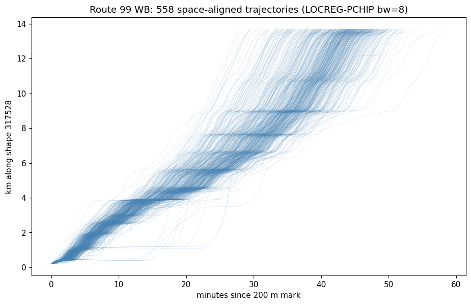
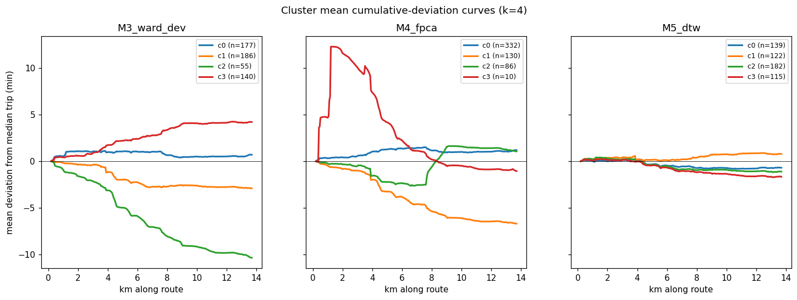
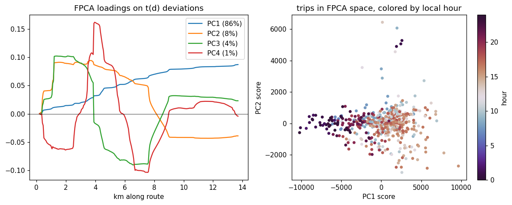
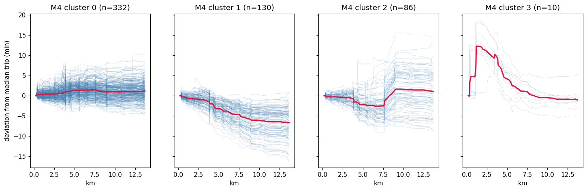
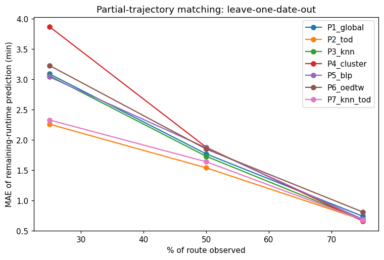

# Clustering bus trajectories: methods memo + first experiments

*Branch `clustering` · July 2026 · corpus: TransLink route 99 B-Line WB from the R2 archive, LOCREG-PCHIP bw=8*

## 1. Goal

Given a corpus of reconstructed trajectories `f(t)` (distance-along-route vs
time) for one route/direction, (a) automatically discover trip "types" —
unusual traffic, high/low demand, incidents — and (b) match a *partial*,
in-progress trip to history to predict its remaining runtime.

## 2. The one design decision that matters: align by space, not time

`f(t)` is monotone, so each trip inverts to **t(d): elapsed time as a
function of distance along the shape**, resampled on a common distance grid
(here every 50 m). After that inversion:

- every trip is a fixed-length vector on the *same spatial domain* — no
  alignment problem left to solve;
- pointwise differences mean something physical ("this trip lost 3 min by
  km 6"), and per-bin differences are pace (s/m), i.e. *where* time is spent;
- a partial trip is simply a truncated vector on a known prefix of the grid.

This is decisive for method choice. Elastic methods like dynamic time
warping exist to fix temporal misalignment — but warping *away* the
difference between a slow and a fast traversal of the same street deletes
exactly the signal we want to cluster on. The literature agrees: when series
share a common index, Euclidean/functional methods match or beat elastic
ones, and our experiments below reproduce that emphatically.

Derived views used throughout: cumulative deviation `dev_i(d) = t_i(d) −
median_j t_j(d)` (how far ahead/behind a typical trip, as a curve) and pace
profiles `Δt_i(d)` (spatial distribution of time spent).

## 3. The corpus

One week (2026-06-23 → 06-29 UTC) of TransLink GTFS-RT vehicle positions
from the R2 archive, route **99 B-Line westbound to UBC** (shape 317528,
14.0 km — the busiest bus route in the feed). TransLink's RT trip_ids match
the static GTFS, so trip extraction is exact. After QC gates
(origin/terminal reach, gap ≤ 4 min, ≥ 30 pings) and terminal truncation:
**578 trips reconstructed at bw=8; 558 cover the full grid** (~80/day).
Runtime spread is wide: p5 = 34.6 min, median = 44.1, p95 = 49.8; PM-peak
median 45.7 vs early-morning 35.1.



Build with `clustering/build_dataset.py`; profiles land in
`outputs/clustering/profiles_r99_wb.npz`.

## 4. Candidate methods (the idea list)

Ordered roughly by how well they fit this data. ✅ = tested here.

**I1 — Space-aligned Euclidean clustering (Ward / k-means on deviation
profiles).** ✅ The workhorse. Cluster the `dev(d)` curves directly with
Ward's linkage. Captures both magnitude *and* location of delay. Cheap,
stable, no hyperparameters beyond k. *Result: the cleanest regime
separation of all methods (M3 below).*

**I2 — Functional PCA → GMM on scores.** ✅ Treat t(d) as functional data
(Ramsay & Silverman); PCA on the deviation curves yields interpretable modes
of variation; cluster the low-dimensional scores with a Gaussian mixture
(BIC selects k). This is the statistically principled "embedding" for smooth
curves — and its scores double as the state for prediction (I8). *Result:
PC1 (86%) = overall slowness; PC2 (8%) = front- vs back-loaded delay;
PC3/PC4 = localized congestion around km 1.5–4 / km 4–7.5. GMM found a
weekend regime and a 10-trip incident cluster no other view isolated.*

**I3 — Engineered scalar features + k-means.** ✅ Total runtime, share of
time per route third, fraction of route below 2 m/s, worst local pace, pace
variance. Transparent and easy to extend (weather, headway). Agrees strongly
with FPCA (ARI 0.62) at a fraction of the sophistication — a good sanity
anchor, but its features are hand-picked FPCA-like summaries.

**I4 — DTW-based clustering (k-medoids on DTW distances; soft-DTW/DBA
barycenters).** ✅ The classic signal-processing answer, matching the d(t)
series elastically. Included as the robustness check. *Result: negative, as
predicted.* On a fixed route the warping absorbs the traffic signal:
silhouette ≈ 0.03 across all k (vs 0.30–0.44 for the space-aligned views),
cluster mean-deviation curves are flat, and agreement with every other
method is ARI ≈ 0. Soft-DTW/DBA would refine barycenters of a structure that
isn't there; not pursued further for full-trip typing.

**I5 — k-Shape / shape-only clustering on z-normalized pace residuals.** ✅
Cross-correlation-based clustering (Paparrizos & Gravano 2015) after
deliberately removing amplitude. Answers only "where is the delay shaped",
not "how slow". *Result: mostly noise-like partitions, but it did isolate a
pure-weekend shape cluster (49 trips, 100% weekend) — evidence that weekends
redistribute time along the route, not just scale it.*

**I6 — Segment travel-time vectors + probabilistic mixtures.** Pace profiles
*are* segment travel-time vectors; fitting a Bayesian GMM over them (Chen,
Cheng, Jin, Trépanier & Sun, *Transportation Science* 2023) gives soft trip
types *and* calibrated probabilistic remaining-time forecasts in one model.
Not separately tested (M4 is its hard-clustering little sibling); the
natural next model once more weeks of data accumulate.

**I7 — Prefix matching for live prediction: kNN / kernel regression.** ✅
Sinn et al. (ITSC 2012, Dublin buses): compare the current partial
trajectory to historical ones, predict remaining time as a
similarity-weighted vote. In t(d) space this is plain Euclidean distance on
the observed prefix — no open-end machinery needed. Cristóbal et al.
(*Sensors* 2019) is the cluster-flavored variant (match to cluster
medoid/mean). Both tested, plus a time-of-day-restricted hybrid.

**I8 — PACE-style conditional expectation (functional regression).** ✅ The
FDA answer to partial curves (Yao, Müller & Wang 2005): the Gaussian
conditional expectation of the remaining time given the observed prefix,
computed from the train covariance (equivalently a heavily-regularized
linear readout of the prefix). Elegant, gives uncertainty bands, and is the
same machinery as I2 — one basis serves clustering and prediction.

**I9 — Open-end DTW in the time domain.** ✅ Tormene et al. 2009: match the
elapsed d(t) series to full historical series with a free endpoint; donors
vote with their remaining time from the matched point. The right tool *if*
one refuses the t(d) inversion; tested as the time-domain control.

**I10 — Deep trajectory embeddings (t2vec / trajectory2vec / DTC).**
Considered, rejected for now: those models exist to learn spatial structure
across many routes from 10⁵–10⁶ trajectories. On a fixed route the FPCA
scores *are* the low-dimensional embedding — learned from 500 trips, fully
interpretable. Revisit only for a multi-route, multi-agency version.

Also worth a line: **matrix-profile motif mining** (stumpy) could find
recurring sub-trip delay motifs (a signature signal-queue pattern) — a
different question than whole-trip typing; and **cluster-residual anomaly
detection** falls out of I1/I2 for free (trips far from every centroid; the
10-trip incident cluster is the existence proof).

## 5. Experiment A — clustering full trajectories

`clustering/exp_full_clustering.py`, k = 4 for cross-method comparison
(FPCA-GMM BIC also selects 4).

Silhouette (each method in its own space):

| k | M1 runtime | M2 features | M3 ward-dev | M4 FPCA | M5 DTW |
|---|-----------|-------------|-------------|---------|--------|
| 2 | 0.60 | 0.69 | 0.44 | 0.18 | 0.03 |
| 3 | 0.53 | 0.23 | 0.39 | 0.33 | 0.03 |
| 4 | 0.54 | 0.28 | 0.30 | 0.35 | 0.00 |

The k=4 regimes (M3/M4, cross-validated by the external metadata that was
*not* used in fitting):

- **Peak/slow** (~140–180 trips): +4 min vs median, concentrated midday+PM
  peak, weekday-heavy — the congestion regime.
- **Typical** (~180–330): flat deviation, mixed hours.
- **Fast/progressive** (~55–130): −7…−10 min, accumulating advantage along
  the whole route; night/early + evening — the free-flow regime.
- **Weekend/redistributed** (M4 c2, 86 trips, 80% weekend): near-median
  first 7.5 km, then a step change around km 7.5–9 — weekends don't just
  scale the trip, they move where the time goes.
- **Incident** (M4 c3, n=10): +12 min lost by km 1.5, slowly recovered —
  a bunching/incident signature that only the functional view isolated.





Takeaways: (1) space-aligned Euclidean and FPCA views find real, physically
interpretable structure; (2) DTW finds nothing here — the warping invariance
is the wrong invariance for a fixed route; (3) shape-only methods add a
complementary nuance (weekend redistribution) but shouldn't be primary.

## 6. Experiment B — matching partial trips, predicting remaining runtime

`clustering/exp_partial_matching.py`. Leave-one-date-out over the 7 days; a
test trip is observed up to q of the route; predict time to finish. MAE in
minutes:

| q | P1 global | P2 TOD | P3 kNN | P4 cluster | P5 BLP | P6 OE-DTW | P7 kNN+TOD |
|-----|------|------|------|------|------|------|------|
| 25% | 3.09 | **2.26** | 3.06 | 3.87 | 3.04 | 3.23 | 2.33 |
| 50% | 1.77 | **1.54** | 1.73 | 1.88 | 1.87 | 1.85 | 1.64 |
| 75% | 0.74 | 0.68 | 0.68 | **0.66** | 0.69 | 0.81 | 0.68 |

(P1 = unconditional median; P2 = median of trips departing within ±90 min;
P3 = kNN on the t(d) prefix; P4 = nearest cluster mean, Cristóbal-style;
P5 = conditional-expectation linear readout; P6 = open-end DTW in the time
domain; P7 = kNN within the TOD window.)



The honest headline: **with one week of history, the clock beats the
trajectory.** Time-of-day conditioning captures most of the predictable
variance; prefix similarity roughly matches it but doesn't beat it, even
when the analysis is restricted to trips whose prefix is *unusual* for
their departure time (>2 min off: P2 2.95 vs P3 4.20 at q=25%). A trip's
own past turns out to be a weak predictor of its future on this route —
deviations are mostly generated downstream, by conditions the clock proxies
better than the prefix does.

Why this shouldn't be the final word:

- **Donor starvation.** LOO leaves ~480 trips; a ±90 min TOD window holds
  only ~35 donors, and kNN-within-TOD (P7) can't find 15 genuinely similar
  neighbours. The regime-matching methods are exactly the ones that improve
  with archive depth; the scraper adds ~80 trips/day.
- All pairwise-similarity methods here used the *whole* prefix; weighting
  recent kilometres and adding headway (bunching state) are the obvious
  upgrades before concluding trajectory matching is redundant.
- At q=75% every method lands within 0.15 min — remaining-time variance is
  simply small near the end.

## 7. Recommended path

1. **Adopt t(d)-on-a-distance-grid as the canonical representation** (it's
   what `build_dataset.py` emits) and FPCA+GMM (I2) as the primary typing
   model, with Ward (I1) as the cheap cross-check. Drop DTW for full-trip
   typing; keep OE-DTW only if we ever must operate on raw f(t).
2. **Let the archive grow** (weeks → months), then re-run Experiment B; add
   headway/bunching features and recency-weighted prefix distance; expect
   P7-style regime-conditioned matching to pull ahead of the TOD baseline.
3. **Promote the incident/weekend clusters into products**: cluster-residual
   anomaly flagging, and per-regime schedule/runtime profiles.
4. Longer term: the Bayesian GMM over segment travel times (I6) unifies
   (a) and (b) — soft clusters + calibrated probabilistic remaining-time
   forecasts — and FPCA scores make a natural online state for it.

## Reproduce

```bash
git checkout clustering
PYTHONPATH=src:clustering uv run python clustering/build_dataset.py
PYTHONPATH=src:clustering uv run python clustering/exp_full_clustering.py
PYTHONPATH=src:clustering uv run python clustering/exp_partial_matching.py
```

Outputs land in `outputs/clustering/` (gitignored); the figures embedded
above are committed copies under `clustering/figures/`.

### Key references

- Sinn, Yoon, Calabrese, Bouillet — *Predicting arrival times of buses using
  real-time GPS measurements*, IEEE ITSC 2012 (kernel regression on partial
  trajectories).
- Cristóbal et al. — *Bus Travel Time Prediction Model Based on Profile
  Similarity*, Sensors 2019 (k-medoids profiles + prefix-to-medoid matching).
- Yao, Müller, Wang — *Functional Data Analysis for Sparse Longitudinal
  Data*, JASA 2005 (PACE conditional expectation for partial curves).
- Chen, Cheng, Jin, Trépanier, Sun — *Probabilistic forecasting of bus
  travel time with a Bayesian Gaussian mixture model*, Transportation
  Science 2023.
- Tormene, Giorgino, Quaglini, Stefanelli — open-end DTW, AI in Medicine
  2009. · Petitjean et al., DBA, Pattern Recognition 2011. · Cuturi &
  Blondel, Soft-DTW, ICML 2017. · Paparrizos & Gravano, k-Shape, SIGMOD
  2015. · Reich et al., ETA-prediction survey, arXiv:1904.05037.
